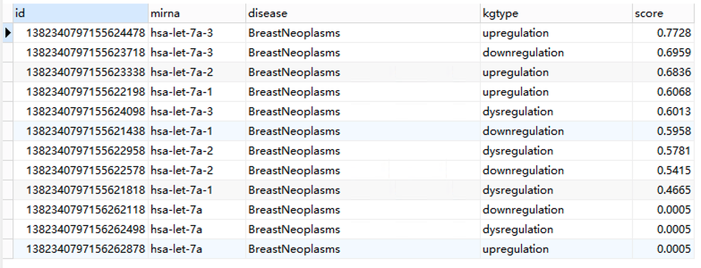

Fork注释：作者从HMDD v3.2中的1206种miRNA 和 893种disease（实测894）之间的35547种关联中，选择了包含380种疾病和548种基因的共30442条关联来进行训练。

# KDFGMDA

#### Abstract
Motivation: increasing biological evidence indicated that miRNAs play a vital role in exploring the pathogenesis of various human diseases (especially in tumors). Mining disease-related miRNAs is of great significance for the clinical diagnosis and treatment of diseases. Compared with the traditional experimental methods with the significant limitations of high cost, long cycle and small scale,  the methods based on computing has the advantages of cost-effective. However, although the current methods based on computational biology can accurately predict the correlation between miRNAs and disease, they can not predict the detailed association information at a fine level.
Results: we propose a knowledge driven approach to fine-grained prediction of disease-related miRNAs(KDFGMDA). Different from the previous methods, this method can finely predict the clear associations between miRNA and disease, such as upregulation(UR), downregulation(DR) or dysregulation(SR). Specifically, KDFGMDA extracts triple information from massive experimental data and existing datasets to construct a knowledge graph, and then trains a depth graph representation learning model based on knowledge graph to complete fine-grained prediction tasks. Experimental results show that KDFGMDA can predict the relationship between miRNA and disease accurately, which is of far-reaching significance for medical clinical research and early diagnosis, prevention and treatment of diseases. Additionally, case study on three type cancers further provide the effectiveness and feasibility of KGFGMDA to detect potential candidate miRNAs.

#### Framework and Results
##framework

## Data Normalization

Although the current HMDD data set provides  a rich and reliable knowledge database, the description of the association between miRNA and disease is nonstandard and disorderly, and it is difficult to construct the knowledge graph of miRNA disease according to the current data. As shown in following picture, we counted some irregular relationship descriptions and drew a pie chart. From the picture, we can see that many descriptions express the same meaning. For example, up-regulated, overexpressed, overexpression, and up-regulated are all upregulation relationships.

##Results

